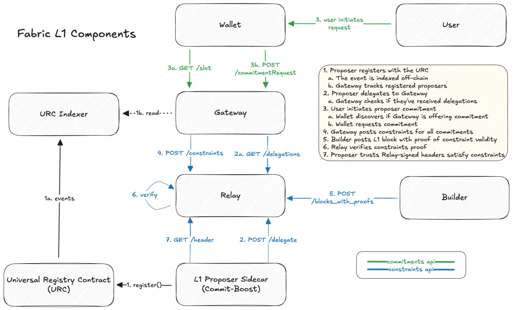
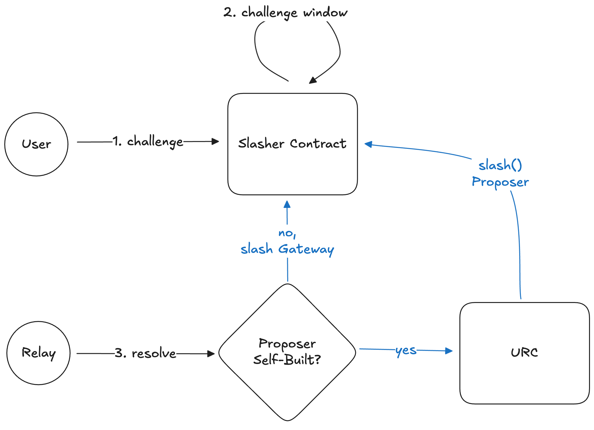

## Inclusion Slashoor

A PoC implementation of a Slasher contract for L1 inclusion preconfs compatible with the [URC](https://github.com/eth-fabric/urc), [Constraints Specs](http://github.com/eth-fabric/constraints-specs), and [Commitments Specs](http://github.com/eth-fabric/commitments-specs).

## Requirements

### Proposer
#### Registering to the URC
The Proposer must call `register()` on the URC, supplying `SignedRegistrations` produced using their BLS key, following the [Commit-Boost signing specs](https://github.com/Commit-Boost/commit-boost-client/blob/2dfe96b8d45d9c2bb37f71d56130a066dec16ec8/crates/common/src/types.rs#L307) (instructions [here](https://github.com/eth-fabric/constraints-specs/blob/signature-docs/specs/proposer.md#preparing-registrations)).
#### Broadcasting Delegations
The Proposer must post `SignedDelegation` to the Relay using the [POST /delegate](https://eth-fabric.github.io/constraints-specs/#/Constraints%20API/postDelegate) endpoint. The `SignedDelegation` is produced using their BLS key, following the [Commit-Boost signing specs](https://github.com/Commit-Boost/commit-boost-client/blob/2dfe96b8d45d9c2bb37f71d56130a066dec16ec8/crates/common/src/types.rs#L307) (instructions [here](https://github.com/eth-fabric/constraints-specs/blob/signature-docs/specs/proposer.md#preparing-a-delegation)).

### Relay
#### Receiving `SignedDelegation` messages
The Relay must receive and store `SignedDelegation` messages from Proposers, ensuring the signature is valid. They should make the `SignedDelegation` available via the [GET `/delegations`](https://eth-fabric.github.io/constraints-specs/#/Constraints%20API/getDelegations) endpoint.

#### Receiving `SignedConstraints`
The Relay must receive and store `SignedConstraints` messages from Gateways. They should make the `SignedConstraints` available via the [GET `/constraints`](https://eth-fabric.github.io/constraints-specs/#/Constraints%20API/getConstraints) endpoint. They must enforce a cut-off time where they stop accepting `SignedConstraints` per slot (see [fault attribution](https://github.com/eth-fabric/constraints-specs/blob/signature-docs/specs/fault-attribution.md#2-data-availability-layer)).

#### Receiving block with proofs
Upon receieving a block, the Relay must verify the Merkle inclusion proofs satisfy all inclusion preconf constraints that are part of the `SignedConstraints` message. If and only if they are all valid will the Relay make the block accessible to the Proposer via the standard `GET /header` endpoint.


### Gateway
#### Receiving `CommitmentRequest`
The Gateway [must ingest `CommitmentRequest` messages](https://github.com/eth-fabric/constraints-specs/blob/signature-docs/specs/gateway.md#receiving-commitment-requests) for inclusion preconfs, where the `CommitmentRequest.payload` is the abi-encoded `InclusionPayload`.

```python
class InclusionPayload(Container):
    tx_hash: Bytes32
    nonce: uint256
    gas_limit: uint256
    slot: uint64
```

They will respond with a `SignedCommitment`, where the `SignedCommitment.commitment.payload` is the abi-encoded `InclusionPayload`, the `SignedCommitment.commitment.request_hash` is the keccak256 of the abi-encoded `CommitmentRequest`, and the `SignedCommitment.commitment.slasher` is the address of the Slasher contract defined in this repo.

#### Post `SignedConstraints`
The Gateway must generate only one `SignedConstraints` message that captures constraints for all `SignedCommitment` messages they've issued. Each `Constraint.payload` is identical to the `CommitmentRequest.payload`.

The Gateway must post the `SignedConstraints` message to the Relay before the cut-off time using the [POST /constraints](https://eth-fabric.github.io/constraints-specs/#/Constraints%20API/postConstraints) endpoint.


### Builder
#### Building a valid block
The Builder must retrieve the `SignedConstraints` from the Relay via the [GET /constraints](https://eth-fabric.github.io/constraints-specs/#/Constraints%20API/getConstraints) (instructions [here](https://github.com/eth-fabric/constraints-specs/blob/signature-docs/specs/builder.md#constraint-processing)). 

For each abi-encoded `InclusionPayload` in the `SignedConstraints.message.constraints`, the Builder will include the requested transactions in the block. 

The Builder will generate Merkle inclusion proofs for each preconfed transaction and include it in their submission to the [POST /blocks_with_proofs](https://eth-fabric.github.io/constraints-specs/#/Constraints%20API/submitBlocksWithProofs) endpoint.

## Slashing
Slashing is required if the block fails to include any transactions for which a `SignedCommitment` was issued. There are two ways this could happen, so the Slasher contract needs to be able to handle each case. Note that Builders are not slashable in this PoC, since they are required to submit proofs (i.e., the [pessimistic case](https://github.com/eth-fabric/constraints-specs/blob/signature-docs/specs/fault-attribution.md#pessimistic-relaying)). If the Relay relayed a block with invalid proofs then they would be socially slashed.

Each case will start the same way:
1. User initiates a challenge ("`Tx with hash 0x1234... was not included`") and puts down a bond to prevent griefing. 
2. Anyone can post a Merkle inclusion proof within the challenge window to resolve the challenge and claim the bond.

If a proof cannot be submitted within the window, we must fall into one of the fault resolution cases.

#### Case 1: Proposer Fault
The Proposer is at fault if they publish a self-built block that was not received from the `GET /header` end-point (i.e., they wouldn't know how to build a block that satisfies all commitments since it was the Gateway who issued them).

The Relay knows all the blocks they relayed, so they can determine whether or not the proposer self-built. After the challenge window, the Relay can call into the URC to slash the Proposer.

#### Case 2: Gateway Fault
The Gateway is at fault if they issued a `SignedCommitment` that did not translate into a `Constraint` that was part of their `SignedConstraints` message.

While it's possible to prove non-inclusion via a another challenge/response scheme, a simpler approach is for the Relay to call into the Slasher to slash the Gateway after the challenge window. This is because the fault is either the Proposer's or the Gateway's. 

Overall, the fault resolution looks like:



## Constants
| Field | Value |
|-------|--------|
| commitment_type | 0x01 |
| constraint_type | 0x01 |
| slash_amount    | 1 ether |